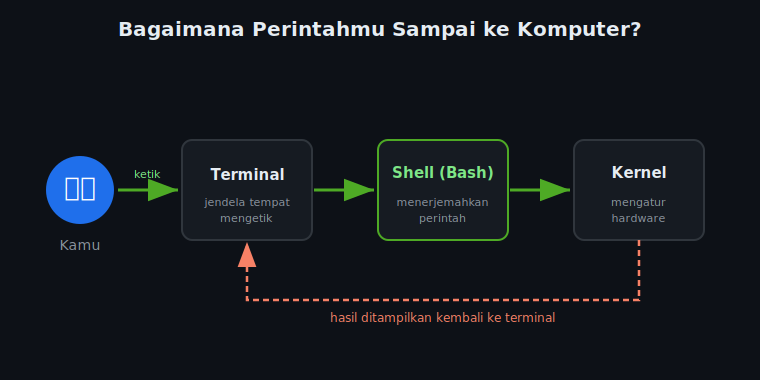

# 🖥️ Modul 1 — Pengenalan Terminal & Bash

> **Durasi:** ~15 menit | **Level:** Pemula Mutlak
>
> *"Terminal adalah pintu masuk ke dunia bioinformatika."*

---

## 1.1 Apa itu Terminal?

**Terminal** (juga disebut *command prompt*, *console*, atau *shell*) adalah antarmuka berbasis teks untuk berkomunikasi dengan komputer. Berbeda dengan GUI (Graphical User Interface) yang menggunakan mouse dan tombol, terminal menggunakan **perintah teks**.

```
┌─────────────────────────────────────────────────┐
│                   TERMINAL                      │
│─────────────────────────────────────────────────│
│  username@hostname:~/workshop$ _                │
│                                                 │
│  ↑ Ini disebut "prompt"                         │
│    Menunjukkan: user, komputer, dan lokasi kamu │
└─────────────────────────────────────────────────┘
```

### Mengapa bioinformatisian menggunakan terminal?

| Situasi | GUI | Terminal (Bash) |
|---------|-----|-----------------|
| Proses 1 file | ✅ Mudah | ✅ Mudah |
| Proses 1.000 file | ❌ Manual satu-satu | ✅ **1 baris command!** |
| Data 100 GB | ❌ Sering crash | ✅ Stabil, efisien |
| Otomasi analisis | ❌ Tidak bisa | ✅ **Bisa dibuat script** |
| Di server/HPC | ❌ Tidak ada GUI | ✅ **Satu-satunya cara** |
| Reproduktibilitas | ❌ Sulit didokumentasi | ✅ **Tinggal simpan commands** |

---

## 1.2 Apa itu Shell dan Bash?

```
┌─────────────────────────────────────────────────────┐
│                   KOMPUTER                          │
│                                                     │
│  ┌──────────────────┐                               │
│  │   HARDWARE       │  ← CPU, RAM, Storage          │
│  └────────┬─────────┘                               │
│           │                                         │
│  ┌────────▼─────────┐                               │
│  │   KERNEL (OS)    │  ← Linux, macOS               │
│  └────────┬─────────┘                               │
│           │                                         │
│  ┌────────▼─────────┐                               │
│  │   SHELL          │  ← bash, zsh, fish, sh        │
│  └────────┬─────────┘                               │
│           │                                         │
│  ┌────────▼─────────┐                               │
│  │   KAMU           │  ← Mengetik commands          │
│  └──────────────────┘                               │
└─────────────────────────────────────────────────────┘
```

Dan inilah alur perjalanan perintahmu — dari ketikan sampai kembali jadi hasil di layar:



- **Shell** = penerjemah antara kamu dan sistem operasi
- **Bash** (Bourne Again SHell) = jenis shell yang paling umum di Linux/macOS
- Di bioinformatika, **bash adalah standar industri**

---

## 1.3 Struktur Filesystem Linux

```
/                        ← ROOT: puncak semua direktori
├── home/                ← Direktori semua pengguna
│   └── username/        ← HOME kamu (~)
│       ├── Documents/
│       ├── Downloads/
│       └── workshop/    ← Tempat kita bekerja
├── usr/
│   └── bin/             ← Program-program (grep, awk, python, dll)
├── tmp/                 ← File sementara
├── etc/                 ← File konfigurasi sistem
└── data/                ← Sering digunakan di server bioinformatika
```

### Simbol penting:
| Simbol | Artinya |
|--------|---------|
| `/` | Root direktori (awal semua path) |
| `~` | Home direktori kamu (`/home/username`) |
| `.` | Direktori saat ini |
| `..` | Direktori satu level di atas |

---

## 1.4 Perintah Pertama Kamu

Buka terminal dan coba perintah-perintah ini:

### Siapa kamu di sistem ini?
```bash
whoami
# Output: username
```

### Tanggal dan waktu sekarang?
```bash
date
# Output: Sat Jul 18 10:15:00 WIB 2026
```

### Di mana kamu sekarang?
```bash
pwd
# Output: /home/username
# (pwd = Print Working Directory)
```

### Cetak teks ke layar
```bash
echo "Halo dari terminal bioinformatika!"
# Output: Halo dari terminal bioinformatika!
```

### Informasi sistem
```bash
uname -a
# Output: Linux hostname 5.15.0 ... (info sistem operasi)
```

---

## 1.5 Cara Membaca Perintah Bash

```
grep  -n  -i  "ATCG"  sequences.fasta
  │    │   │     │          │
  │    │   │     │          └─ ARGUMENT (input file)
  │    │   │     └─ ARGUMENT (pola yang dicari)
  │    │   └─ OPSI/FLAG (-i = case insensitive)
  │    └─ OPSI/FLAG (-n = tampilkan nomor baris)
  └─ PERINTAH (command)
```

### Aturan penting:
- **Case sensitive!** `ls` ≠ `LS` ≠ `Ls`
- **Spasi penting!** `grep-n` ≠ `grep -n`
- Gunakan **Tab** untuk auto-complete nama file/perintah
- **Ctrl+C** untuk membatalkan perintah yang sedang berjalan
- **Ctrl+L** atau `clear` untuk membersihkan layar

### ⚡ Shortcut & Terminal Lifehacks (Penyelamat Waktu!)
Menguasai shortcut ini akan membuat kamu bekerja jauh lebih cepat dan terlihat seperti ahli:

| Shortcut | Fungsi |
|----------|--------|
| `Tab` | **Auto-complete** nama file, folder, atau perintah (tekan 2 kali untuk melihat opsi) |
| `↑` / `↓` | Menelusuri riwayat perintah yang pernah kamu ketik sebelumnya |
| `Ctrl + C` | Menghentikan paksa perintah yang sedang berjalan atau hang |
| `Ctrl + L` | Membersihkan layar terminal (sama dengan perintah `clear`) |
| `Ctrl + A` | Memindahkan kursor langsung ke **awal baris** |
| `Ctrl + E` | Memindahkan kursor langsung ke **akhir baris** |
| `Ctrl + U` | Menghapus seluruh ketikan dari posisi kursor ke awal baris |
| `Ctrl + W` | Menghapus satu kata di sebelah kiri kursor |
| `Ctrl + R` | Mencari perintah yang pernah diketik sebelumnya di riwayat (*reverse-i-search*) |
| `!!` | Menjalankan kembali perintah terakhir |
| `!$` | Mengambil argumen terakhir dari perintah sebelumnya |

---

## 1.6 Mendapatkan Bantuan

```bash
# Cara 1: Manual page (dokumentasi lengkap)
man grep
# Tekan 'q' untuk keluar dari manual

# Cara 2: Help singkat
grep --help

# Cara 3: Cari perintah yang berhubungan
man -k "file"

# Cara 4: which (cek lokasi program)
which grep
which python3
which bash
```

---

## 1.7 History: Perintah yang Pernah Dijalankan

```bash
# Lihat riwayat perintah
history

# Lihat 10 perintah terakhir
history | tail -10

# Cari perintah tertentu di history
history | grep "grep"

# Ulangi perintah sebelumnya
!!

# Ulangi perintah ke-n dari history
!100
```

---

## 🧬 Relevansi Bioinformatika

Di bioinformatika, kamu akan menggunakan terminal untuk:
- Menjalankan tools seperti `bwa`, `samtools`, `BLAST`, `FastQC`
- Memproses ribuan file FASTQ dari sekuensing
- Membuat pipeline analisis yang bisa diulang (reproducible)
- Bekerja di server/HPC (High Performance Computing) yang hanya punya CLI

```bash
# Contoh perintah bioinformatika yang akan kamu pelajari:
grep ">" sequences.fasta | wc -l        # Hitung jumlah sequence
awk -F'\t' '{print $1, $3-$2}' regions.bed  # Hitung panjang region
```

---

## ✅ Checkpoint Modul 1

Sebelum lanjut ke Modul 2, pastikan kamu bisa:

- [ ] Membuka terminal di sistem kamu
- [ ] Menjalankan `whoami`, `pwd`, `date`, `echo`
- [ ] Memahami perbedaan shell dan bash
- [ ] Memahami struktur direktori Linux (root, home, ~)
- [ ] Menggunakan `man` atau `--help` untuk mendapatkan bantuan

---

**➡️ Lanjut ke:** [`../02-navigasi-file/README.md`](../02-navigasi-file/README.md)

---

*Modul 1 dari 5 | Workshop Bash for Biological Data Analysis — OmicsLite 2026*
