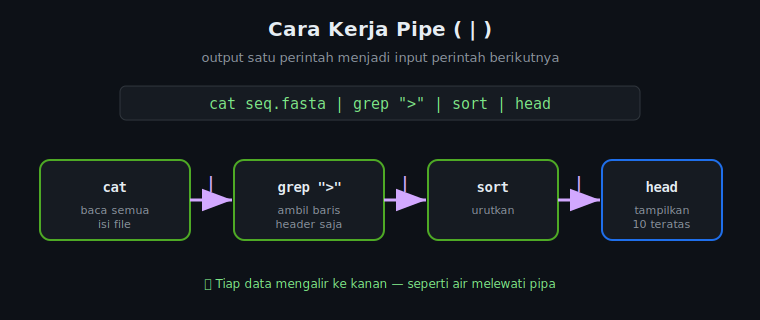

# 🔍 Modul 3 — Pengolahan Teks dengan Bash

> **Durasi:** ~30 menit | **Level:** Pemula–Menengah
>
> *"80% pekerjaan bioinformatika adalah memproses teks."*

---

## 3.1 Grep — Global Regular Expression Print

`grep` adalah senjata utama bioinformatician. Digunakan untuk **mencari pola** dalam file.

> 💡 **Mengenal Berkas Data (Sekilas)**
> Di modul ini, kita akan berlatih memproses beberapa format berkas standar bioinformatika:
> * **`.fasta`**: Format sekuens DNA/Protein. Baris nama sekuens diawali tanda `>` (sebagai header), diikuti baris sekuens nukleotida (A, C, T, G).
> * **`.bed`**: Format koordinat fitur genomik (minimal 3 kolom dipisahkan oleh Tab). Kolom 1 = nama kromosom, Kolom 2 = posisi mulai, Kolom 3 = posisi selesai.
> * **`.gff`**: Format anotasi genomik yang lebih detail (memiliki 9 kolom dipisahkan oleh Tab).
> * **`.csv` / `.tsv`**: Format tabel umum (dipisahkan koma atau tab) yang biasa berisi metadata sampel.
> 
> *Catatan: Penjelasan mendalam mengenai struktur biologis tiap format di atas akan kita bedah secara tuntas di **Modul 4**.*

### Sintaks dasar
```bash
grep "pola" file.txt
```

### Contoh-contoh penting
```bash
# Cari teks sederhana
grep "ATCG" data/sequences.fasta

# Case insensitive (-i)
grep -i "atcg" data/sequences.fasta

# Tampilkan nomor baris (-n)
grep -n ">" data/sequences.fasta

# Hitung jumlah kemunculan (-c)
grep -c ">" data/sequences.fasta

# Tampilkan yang TIDAK mengandung pola (-v = invert)
grep -v ">" data/sequences.fasta

# Cari di banyak file sekaligus
grep ">" data/*.fasta

# Cari rekursif di semua file dalam direktori (-r)
grep -r "BRCA1" data/

# Tampilkan konteks sekitar hasil (3 baris sebelum dan sesudah)
grep -A 1 ">" data/sequences.fasta   # A = After
grep -B 1 "GATK" data/log.txt        # B = Before
grep -C 2 "ERROR" data/pipeline.log  # C = Context (sebelum & sesudah)

# Exact word match (-w)
grep -w "chr1" data/regions.bed

# Tampilkan nama file saja (-l = list files only)
grep -l "homo_sapiens" data/*.fasta

# Hitung total matches di semua file
grep -c ">" data/*.fasta
```

### Grep untuk FASTA files (sangat sering digunakan!)
```bash
# Hitung jumlah sequence (header dimulai dengan >)
grep -c "^>" data/sequences.fasta

# Tampilkan semua header
grep "^>" data/sequences.fasta

# Cari sequence dari organisme tertentu
grep "Homo sapiens" data/sequences.fasta

# Cari header yang mengandung gen tertentu
grep -i "BRCA1\|TP53\|KRAS" data/sequences.fasta
```

### 🧬 Pencarian Motif DNA dengan Regular Expressions (Regex)
`grep` mendukung pencarian menggunakan ekspresi reguler (regular expressions) yang sangat berguna untuk mendeteksi motif sekuens DNA/RNA atau pola teks kompleks:

```bash
# 1. Menggunakan Extended Regex dengan opsi -E (mencari motif A ATAU B)
# Mencari sekuens yang mengandung situs restriksi EcoRI (GAATTC) ATAU HindIII (AAGCTT)
grep -E "GAATTC|AAGCTT" data/sequences.fasta

# 2. Menggunakan titik (.) sebagai wildcard (satu karakter apa saja)
# Contoh: mencari situs motif "C-N-N-G" (C, diikuti dua basa bebas, diikuti G)
grep "C..G" data/sequences.fasta

# 3. Menggunakan kurung siku ([...]) untuk mencocokkan set karakter tertentu
# Contoh: mencari daerah kaya purin (A atau G) sepanjang 5 basa berurutan
grep -E "[AG]{5}" data/sequences.fasta

# Contoh: mencari sekuens kaya pirimidin (C atau T) sepanjang 10 basa berurutan
grep -E "[CT]{10}" data/sequences.fasta

# 4. Mencocokkan kodon di awal (^) atau akhir ($) baris sekuens
grep "^ATG" data/sequences.fasta        # Sekuens yang diawali start kodon ATG
grep "TAA$" data/sequences.fasta        # Sekuens yang diakhiri stop kodon TAA

# 5. Menampilkan HANYA motif yang cocok (-o = only-matching)
# Sangat berguna untuk ekstraksi motif spesifik (tidak mencetak seluruh baris sekuens)
grep -o "GAATTC" data/sequences.fasta
```

---

## 3.2 Wc — Word Count

```bash
# Hitung baris, kata, dan karakter
wc data/sequences.fasta
# Output: 12  38  548 data/sequences.fasta
#          │    │    └── karakter
#          │    └─────── kata
#          └──────────── baris (lines)

# Hitung baris saja (-l = lines)
wc -l data/sequences.fasta

# Hitung karakter saja (-c = characters)
wc -c data/sequences.fasta

# Hitung kata saja (-w = words)
wc -w data/sequences.fasta

# Praktis: hitung jumlah sequence dalam FASTA
grep -c "^>" data/sequences.fasta

# Atau kombinasikan:
grep "^>" data/sequences.fasta | wc -l
```

---

## 3.3 Cut — Memotong Kolom

`cut` digunakan untuk mengambil kolom tertentu dari file yang terstruktur (TSV, CSV, BED, GFF).

```bash
# Ambil karakter ke-1 sampai 10
cut -c 1-10 data/gene_list.txt

# Ambil kolom tertentu (field) dari file TSV
# -d '\t' = delimiter tab, -f 1 = field ke-1
cut -d $'\t' -f 1 data/annotation.bed

# Ambil kolom 1 dan 3 dari file BED (chr dan end position)
cut -f 1,3 data/regions.bed

# Ambil kolom 1-3
cut -f 1-3 data/regions.bed

# Untuk file CSV (koma sebagai delimiter)
cut -d ',' -f 2 data/metadata.csv

# Contoh dengan file GFF (tab-delimited):
# Chr  Source  Feature  Start  End  Score  Strand  Frame  Attribute
cut -f 1,3,4,5 data/annotation.gff  # Ambil Chr, Feature, Start, End
```

---

## 3.4 Sort — Mengurutkan

```bash
# Urut alfabetis (default)
sort data/gene_list.txt

# Urut angka (-n = numeric)
sort -n data/scores.txt

# Urut terbalik (-r = reverse)
sort -r data/gene_list.txt
sort -rn data/scores.txt

# Urut berdasarkan kolom tertentu (-k = key)
sort -k2,2n data/regions.bed      # Urut berdasarkan kolom 2 (numerik)
sort -k1,1 -k2,2n data/regions.bed  # Urut kolom 1 dulu, lalu kolom 2

# Hapus duplikat saat sorting (-u = unique)
sort -u data/gene_list.txt

# Sort file BED (standar bioinformatika)
sort -k1,1 -k2,2n data/regions.bed > data/regions_sorted.bed
```

---

## 3.5 Uniq — Menangani Duplikat

> ⚠️ `uniq` hanya bekerja pada file yang **sudah diurutkan!**

```bash
# Hapus baris duplikat berurutan
sort data/gene_list.txt | uniq

# Hitung kemunculan setiap baris (-c = count)
sort data/gene_list.txt | uniq -c

# Tampilkan hanya yang duplikat (-d = duplicated)
sort data/gene_list.txt | uniq -d

# Tampilkan hanya yang unik (-u = unique only)
sort data/gene_list.txt | uniq -u

# Contoh: Hitung berapa kali tiap kromosom muncul di file BED
cut -f 1 data/regions.bed | sort | uniq -c | sort -rn
```

---

## 3.6 Pipe (|) — Menggabungkan Perintah

**Pipe** adalah senjata paling powerful di bash! Ia mengirim **output** dari satu perintah sebagai **input** ke perintah berikutnya.

```
perintah1 | perintah2 | perintah3 | ...
```



### Contoh pipeline bioinformatika:
```bash
# Hitung jumlah sequence unik berdasarkan organisme
grep "^>" data/sequences.fasta | cut -d '|' -f 2 | sort | uniq -c | sort -rn

# Tampilkan 5 kromosom paling banyak region
cut -f 1 data/annotation.bed | sort | uniq -c | sort -rn | head -5

# Cari sequence mengandung ATG (start codon), ambil headernya
grep -B 1 "ATG" data/sequences.fasta | grep "^>"

# Hitung GC content kasar
grep -v "^>" data/sequences.fasta | tr -cd 'GCgc' | wc -c
```

---

## 3.7 Redirection — Menyimpan Output

```bash
# > Simpan output ke file (OVERWRITE jika sudah ada!)
grep "^>" data/sequences.fasta > data/headers.txt

# >> Tambahkan output ke file (APPEND)
grep "^>" data/sequences.fasta >> data/headers.txt

# < Baca input dari file
wc -l < data/sequences.fasta

# 2> Redirect error messages
grep "ATCG" data/*.fasta 2> data/error.log

# &> Redirect output DAN error
# (contoh konsep, pastikan file target ada jika dijalankan)
bwa mem data/reference.fasta data/reads.fastq &> data/alignment.log

# /dev/null: buang output (jangan tampilkan apapun)
grep "ATCG" data/sequences.fasta > /dev/null 2>&1
```

### `tee` — Simpan ke file DAN tampilkan di layar
```bash
grep "^>" data/sequences.fasta | tee data/headers.txt
# → Tampil di layar SEKALIGUS tersimpan di headers.txt
```

---

## 3.8 Awk — Pemrosesan Kolom Tingkat Lanjut

`awk` sangat powerful untuk file tabular (BED, GFF, TSV):

```bash
# Sintaks dasar: awk '{action}' file
# Variabel otomatis: $0 = seluruh baris, $1 = kolom 1, $2 = kolom 2, NR = nomor baris

# Cetak kolom pertama
awk '{print $1}' data/regions.bed

# Cetak kolom 1 dan 3
awk '{print $1, $3}' data/regions.bed

# Cetak dengan separator custom
awk '{print $1 "\t" $2 "\t" $3}' data/regions.bed

# Hitung panjang region dari file BED ($3 = end, $2 = start)
awk '{print $1, $2, $3, $3-$2}' data/regions.bed

# Filter baris berdasarkan nilai kolom (region > 1000 bp)
awk '($3 - $2) > 1000' data/regions.bed

# Filter kromosom tertentu
awk '$1 == "chr1"' data/regions.bed

# Hitung total panjang semua region
awk '{sum += $3 - $2} END {print "Total:", sum, "bp"}' data/regions.bed

# Tambahkan header ke output
awk 'BEGIN {print "Chr\tStart\tEnd\tLength"} {print $1, $2, $3, $3-$2}' data/regions.bed

# Proses file GFF - ambil gene saja
awk '$3 == "gene"' data/annotation.gff

# Hitung rata-rata panjang feature
awk '{sum += $5 - $4; count++} END {print "Average:", sum/count}' data/annotation.gff
```

---

## 3.9 Sed — Stream Editor

`sed` digunakan untuk **mencari dan mengganti** teks, serta transformasi sederhana:

```bash
# Sintaks dasar: sed 's/pola_lama/pola_baru/' file

# Ganti teks pertama di setiap baris
sed 's/chr/chromosome/' data/regions.bed

# Ganti SEMUA kemunculan di tiap baris (g = global)
sed 's/chr/chromosome/g' data/regions.bed

# Simpan perubahan ke file (i = in-place)
sed -i 's/chr/Chr/g' data/regions.bed

# 🍎 Catatan Pengguna macOS (Mac):
# sed di macOS memiliki perilaku berbeda. Kamu harus menambahkan '' setelah -i:
# sed -i '' 's/chr/Chr/g' data/regions.bed

# Ganti di baris tertentu (baris ke-5)
sed '5s/old/new/' data/gene_list.txt

# Hapus baris yang mengandung pola
sed '/^#/d' data/annotation.gff           # Hapus baris komentar (#)
sed '/^$/d' data/sequences.fasta          # Hapus baris kosong

# Tampilkan hanya baris tertentu (seperti head/tail)
sed -n '1,10p' data/sequences.fasta        # Baris 1-10
sed -n '5p' data/sequences.fasta           # Hanya baris 5

# Ganti tab dengan spasi
sed 's/\t/ /g' data/regions.bed

# Uppercase/lowercase (dengan tr lebih mudah):
tr 'a-z' 'A-Z' < data/sequences.fasta     # Uppercase
tr 'atcg' 'ATCG' < data/sequences.fasta   # Uppercase nukleotida saja
```

---

## 3.10 Tr — Translate/Transform

```bash
# Ubah huruf kecil ke kapital
tr 'a-z' 'A-Z' < data/gene_list.txt

# Ubah huruf kapital ke kecil
tr 'A-Z' 'a-z' < data/gene_list.txt

# Hapus karakter tertentu (-d = delete)
tr -d '\n' < data/sequences.fasta   # Hapus newline

# Hitung karakter G dan C dalam sequence
grep -v "^>" data/sequences.fasta | tr -cd 'GCgc' | wc -c
```

---

## 🧬 Mini Quiz — Identifikasi Perintah

Apa yang dilakukan perintah berikut?

```bash
# Perintah 1:
grep "^>" data/sequences.fasta | wc -l

# Perintah 2:
cut -f 1 data/regions.bed | sort | uniq -c | sort -rn | head -5

# Perintah 3:
awk '$3 == "gene" {print $1, $4, $5, $5-$4}' data/annotation.gff | sort -k4,4n

# Perintah 4:
grep -v "^>" data/sequences.fasta | tr -d '\n' | wc -c
```

<details>
<summary>👀 Klik untuk melihat jawaban</summary>

1. Hitung total sequences dalam file FASTA
2. Tampilkan 5 kromosom terbanyak dalam file BED
3. Ambil semua gene, cetak posisi dan panjangnya, urutkan dari terpendek
4. Hitung total nukleotida (tanpa header) dalam file FASTA

</details>

---

## ✅ Checkpoint Modul 3

- [ ] `grep` dengan berbagai flag (-i, -v, -c, -n, -r)
- [ ] Pencarian motif DNA/RNA menggunakan Regular Expressions (Regex) pada `grep`
- [ ] `wc -l` untuk menghitung baris
- [ ] `cut -f` untuk mengambil kolom
- [ ] `sort` dan `uniq` untuk analisis distribusi
- [ ] Pipe `|` untuk menggabungkan perintah
- [ ] Redirection `>` dan `>>` untuk menyimpan output
- [ ] `awk` untuk filter dan kalkulasi kolom
- [ ] `sed` untuk search and replace

---

**➡️ Lanjut ke:** [`../04-biological-formats/README.md`](../04-biological-formats/README.md)

---

*Modul 3 dari 5 | Workshop Bash for Biological Data Analysis — OmicsLite 2026*
