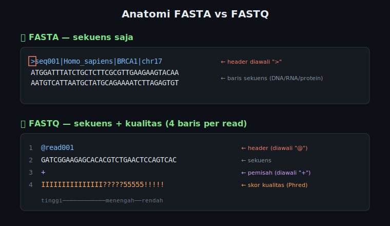

# 🧬 Modul 4 — Format File Bioinformatika

> **Durasi:** ~20 menit | **Level:** Pemula–Menengah
>
> *"Data biologis punya format sendiri. Pahami formatnya, kuasai datanya."*

---

Sebelum masuk detail, ini gambaran besar dua format yang paling sering kamu temui — perhatikan perbedaan strukturnya:



---

## 4.1 Format FASTA

Format paling dasar dan paling sering ditemui di bioinformatika.

### Struktur FASTA
```
>identifier description optional_info
SEQUENCEDATAHERE
SEQUENCEDATACONTINUED
```

### Aturan FASTA:
- Baris **header** dimulai dengan `>` (wajib!)
- Setelah `>`, identifier **tidak boleh ada spasi**
- Sequence boleh di 1 baris atau terpotong-potong (biasanya 60-80 karakter per baris)
- Satu file bisa berisi **banyak sequence** (multi-FASTA)

### Contoh:
```fasta
>NM_007294.4 Homo sapiens BRCA1 mRNA (partial)
ATGGATTTATCTGCTCTTCGCGTTGAAGAAGTACAAAATGTCATTAATGCTATGCAGAAA
ATCTTAGAGTGTCCCATCTGTCTGGAGTTGATCAAGGAACCTGTCTCCACAAAGTGTGAC

>NM_000546.6 Homo sapiens TP53 tumor suppressor mRNA (partial)
CCCCTCCTGGCCCCTGTCATCTTCTGTCCCTTCCCAGAAAACCTACCAGGGCAGCTACGG
TTTCCGTCTGGGCTTCTTGCATTCTGGGACAGCCAAGTCTGTGACTTGCACGTACTCCCC
```

### Perintah bash untuk FASTA:
```bash
# Lihat file FASTA
less data/example.fasta

# Hitung jumlah sequence
grep -c "^>" data/example.fasta

# Tampilkan semua header
grep "^>" data/example.fasta

# Tampilkan sequence saja (tanpa header)
grep -v "^>" data/example.fasta

# Tampilkan header dengan nomor baris
grep -n "^>" data/example.fasta

# Cari sequence tertentu berdasarkan header
grep -A 999 ">NM_000546" data/example.fasta | grep -B 999 "^>" | head -2

# Panjang total nukleotida dalam file
grep -v "^>" data/example.fasta | tr -d '\n' | wc -c

# Hitung GC content kasar (%)
total=$(grep -v "^>" data/example.fasta | tr -d '\n' | wc -c)
gc=$(grep -v "^>" data/example.fasta | tr -cd 'GCgc' | wc -c)
echo "GC content: $(echo "scale=2; $gc * 100 / $total" | bc)%"
```

---

## 4.2 Format FASTQ

Format untuk data **hasil sequencing** (NGS = Next Generation Sequencing). Setiap read terdiri dari **4 baris**:

### Struktur FASTQ
```
@identifier description          ← Baris 1: Header (dimulai @)
SEQUENCEDATA                     ← Baris 2: Sequence DNA
+                                ← Baris 3: Separator (bisa + atau +identifier)
QUALITYSCORES                    ← Baris 4: Quality scores (sama panjang dengan sequence)
```

### Phred Quality Score
Quality score menunjukkan **probabilitas error** suatu base:

| Phred Score | Karakter | Error Probability | Accuracy |
|------------|---------|-------------------|----------|
| 40 (Q40) | `I` | 0.0001 (1 per 10,000) | 99.99% |
| 30 (Q30) | `?` | 0.001 (1 per 1,000) | 99.9% |
| 20 (Q20) | `5` | 0.01 (1 per 100) | 99% |
| 10 (Q10) | `+` | 0.1 (1 per 10) | 90% |

> 🎯 **Standar:** Q30 sudah dianggap kualitas baik untuk analisis NGS

### ASCII encoding (Phred+33):
```
Quality: 0  10  20  30  40
         !   +   5   ?   I
```

### Contoh FASTQ:
```fastq
@SRR6088720.1 read1 length=75
ATCGATCGATCGATCGATCGATCGATCGATCGATCGATCGATCGATCGATCGATCGATCGATCGATCGATCGATCG
+
IIIIIIIIIIIIIIIIIIIIIIIIIIIIIIIIIIIIIIIIIIIIIIIIIIIIIIIIIIIIIIIIIIIIIIIIIIIII
@SRR6088720.2 read2 length=75
GCATGCATGCATGCATGCATGCATGCATGCATGCATGCATGCATGCATGCATGCATGCATGCATGCATGCATGCAT
+
IIIIIIIIIIIIIIIIIIIIIIIIIIIII??????????????????????????????????????IIIIIIIIII
```

### Perintah bash untuk FASTQ:
```bash
# Lihat beberapa read pertama
head -8 data/example.fastq          # 8 baris = 2 reads

# Hitung jumlah reads
wc -l data/example.fastq | awk '{print $1/4, "reads"}'

# Cara lain hitung reads
grep -c "^@" data/example.fastq

# Tampilkan header saja (baris 1, 5, 9, ... = setiap baris ke-4 mulai dari 1)
awk 'NR % 4 == 1' data/example.fastq

# Tampilkan sequence saja (baris 2, 6, 10, ...)
awk 'NR % 4 == 2' data/example.fastq

# Tampilkan quality saja
awk 'NR % 4 == 0' data/example.fastq

# Hitung panjang read pertama
head -2 data/example.fastq | tail -1 | wc -c

# Cek apakah quality dan sequence sama panjang
awk 'NR%4==2{seq=length($0)} NR%4==0{qual=length($0); if(seq!=qual) print NR/4, "MISMATCH"}' data/example.fastq

# Ekstrak reads tertentu (misalnya 100 reads pertama)
head -400 data/example.fastq > first_100_reads.fastq
```

---

## 4.3 Format BED

BED (Browser Extensible Data) digunakan untuk menyimpan **koordinat genomik**. Format tabular dengan tab sebagai separator.

### Struktur BED
```
chr1   1000   2000   gene_A   100   +
│       │      │       │       │    │
│       │      │       │       │    └─ Strand (+ atau -)
│       │      │       │       └────── Score (0-1000)
│       │      │       └────────────── Name (ID feature)
│       │      └────────────────────── End position (0-based, exclusive)
│       └───────────────────────────── Start position (0-based, inclusive)
└───────────────────────────────────── Chromosome
```

### ⚠️ Penting: BED menggunakan koordinat 0-based!
```
Posisi:   0  1  2  3  4  5  6  7  8  9  (0-based)
          1  2  3  4  5  6  7  8  9  10 (1-based, seperti IGV)
Sequence: A  T  C  G  A  T  C  G  A  T

BED start=2, end=5 → covers position 3,4,5 (1-based) → "CGA"
```

### Perintah bash untuk BED:
```bash
# Lihat file BED
head data/example.bed

# Hitung jumlah region
wc -l data/example.bed

# Tampilkan kromosom yang ada
cut -f 1 data/example.bed | sort -u

# Hitung berapa region per kromosom
cut -f 1 data/example.bed | sort | uniq -c | sort -rn

# Hitung panjang setiap region
awk '{print $1, $2, $3, $3-$2, $4}' data/example.bed

# Total panjang semua region (coverage)
awk '{sum += $3 - $2} END {print sum, "bp total"}' data/example.bed

# Panjang rata-rata region
awk '{sum += $3 - $2; n++} END {print sum/n, "bp average"}' data/example.bed

# Ambil region di kromosom tertentu
awk '$1 == "chr1"' data/example.bed

# Ambil region lebih dari 1000 bp
awk '($3 - $2) > 1000' data/example.bed

# Ambil region pada strand positif (+)
awk '$6 == "+"' data/example.bed

# Sort BED (standar bioinformatika)
sort -k1,1 -k2,2n data/example.bed > data/example_sorted.bed

# Menghitung statistik panjang
awk '{print $3-$2}' data/example.bed | sort -n | awk \
  'BEGIN{min=999999;max=0;sum=0;n=0}
   {n++;sum+=$1; if($1<min)min=$1; if($1>max)max=$1}
   END{print "Min:", min, "\nMax:", max, "\nAvg:", sum/n, "\nN:", n}'
```

---

## 4.4 Format GFF/GTF

GFF (General Feature Format) / GTF (Gene Transfer Format) digunakan untuk anotasi fitur genomik.

### Struktur GFF3
```
chr1  HAVANA  gene   11869  14409  .  +  .  ID=gene1;Name=DDX11L1;biotype=lncRNA
│      │        │      │      │   │  │  │  └─ Attributes (key=value pairs)
│      │        │      │      │   │  │  └──── Frame (0,1,2 atau .)
│      │        │      │      │   │  └─────── Strand (+ atau -)
│      │        │      │      │   └────────── Score (. jika tidak ada)
│      │        │      │      └────────────── End (1-based, inclusive)
│      │        │      └───────────────────── Start (1-based, inclusive)
│      │        └──────────────────────────── Feature type
│      └───────────────────────────────────── Source/Program
└──────────────────────────────────────────── Seqname/Chromosome
```

### ⚠️ Perbedaan Penting: Koordinat 0-based (BED) vs 1-based (GFF/GTF)

Salah satu sumber kesalahan (bug) terbesar dalam analisis genomik adalah perbedaan cara menghitung posisi nukleotida (koordinat):

```
Sekuens:     A    T    G    C    A    T
           |    |    |    |    |    |
1-based:   1    2    3    4    5    6   (GFF/GTF, SAM/BAM, VCF, IGV)
           [1, 1] = 'A', [3, 5] = 'GCA' (Inklusif: start & end dihitung)

0-based:  0    1    2    3    4    5    6  (BED)
           [0, 1] = 'A', [2, 5] = 'GCA' (Half-open: start inklusif, end eksklusif)
```

*   **1-based (GFF/GTF, SAM, VCF)**:
    *   Nukleotida pertama bernilai **1**.
    *   Koordinat `start` dan `end` keduanya **inklusif** (masuk hitungan).
    *   *Contoh*: Posisi 3 sampai 5 di atas mencakup `G`, `C`, `A`. Panjang = `5 - 3 + 1 = 3 bp`.
*   **0-based (BED)**:
    *   Penghitungan dimulai sebelum nukleotida pertama, yaitu **0**.
    *   Koordinat `start` bersifat **inklusif**, sedangkan `end` bersifat **eksklusif** (tidak dihitung).
    *   *Contoh*: Koordinat BED `2` sampai `5` mencakup posisi 2 (nukleotida ke-3 yaitu `G`), posisi 3 (`C`), dan posisi 4 (`A`). Nukleotida posisi 5 tidak masuk. Panjang = `5 - 2 = 3 bp` (cukup dikurangi langsung).

### Perintah bash untuk GFF:
```bash
# Abaikan baris komentar (dimulai #)
grep -v "^#" annotation.gff | head

# Tampilkan tipe feature yang ada (kolom 3)
grep -v "^#" annotation.gff | cut -f 3 | sort | uniq -c | sort -rn

# Ambil hanya gene
grep -v "^#" annotation.gff | awk '$3 == "gene"'

# Ambil hanya exon
grep -v "^#" annotation.gff | awk '$3 == "exon"'

# Hitung jumlah gene per kromosom
grep -v "^#" annotation.gff | awk '$3 == "gene" {print $1}' | sort | uniq -c

# Panjang rata-rata gene
grep -v "^#" annotation.gff | awk '$3 == "gene" {sum += $5-$4; n++} END {print sum/n}'

# Ambil strand positif saja
grep -v "^#" annotation.gff | awk '$7 == "+"'

# Ekstrak nama gene dari kolom atribut (GFF3)
grep -v "^#" annotation.gff | awk '$3 == "gene"' | \
  grep -oP 'gene_name "\K[^"]+' | sort | head -20
```

---

## 4.5 Bekerja dengan File Terkompresi (.gz) & Mengunduh Data Genom

Dalam analisis bioinformatika nyata, data mentah sequencing (seperti file FASTQ) berukuran sangat besar (bisa mencapai puluhan hingga ratusan Gigabyte). Oleh karena itu, file tersebut **selalu disimpan dalam keadaan terkompresi** menggunakan format gzip (`.fastq.gz`).

Membuka kompresi file raksasa hanya untuk mengintip isinya adalah pemborosan memori dan waktu yang sangat besar. Bash menyediakan utilitas khusus yang dapat membaca langsung konten file `.gz` tanpa perlu mengekstraknya terlebih dahulu:

### 1. Perintah Membaca File Terkompresi
| Perintah Biasa | Perintah File Terkompresi (`.gz`) | Fungsi |
|----------------|------------------------------------|--------|
| `cat` | `zcat` (atau `gzcat` di macOS) | Menampilkan seluruh isi file terkompresi ke layar |
| `less` | `zless` | Membaca isi file terkompresi secara interaktif |
| `grep` | `zgrep` | Mencari pola teks langsung di dalam file terkompresi |

*Contoh penggunaan:*
```bash
# Mengompresi file FASTQ biasa menjadi format gz
gzip reads.fastq                     # Menghasilkan file reads.fastq.gz

# Membaca 10 baris pertama file .gz tanpa mengekstraknya
zcat reads.fastq.gz | head -n 10

# Mencari jumlah read langsung dari file gz terkompresi
zgrep -c "^+" reads.fastq.gz
```

### 2. Mengunduh Data Genom via Terminal (`wget` & `curl`)
Kita sering kali harus mengunduh sekuens genom acuan (reference genome) dari basis data publik seperti NCBI atau Ensembl melalui terminal:

```bash
# Mengunduh menggunakan wget (menyimpan file dengan nama aslinya)
wget ftp://ftp.ensembl.org/pub/release-110/fasta/homo_sapiens/dna/Homo_sapiens.GRCh38.dna.chromosome.22.fa.gz

# Mengunduh menggunakan curl (wajib menggunakan opsi -O untuk mengunduh dengan nama asli)
curl -O https://ftp.ncbi.nlm.nih.gov/genomes/all/GCF/000/001/405/GCF_000001405.40_GRCh38.p14/GCF_000001405.40_GRCh38.p14_genomic.fna.gz
```

---

## 4.6 Perbandingan Format

| Format | Ekstensi | Untuk | Kolom wajib | Koordinat |
|--------|---------|-------|-------------|-----------|
| FASTA | `.fa`, `.fasta`, `.fna`, `.faa`, `.fsa` | Sequence | Header + Seq | - |
| FASTQ | `.fq`, `.fastq`, `.fq.gz`, `.fastq.gz` | Sequencing reads + quality | 4 baris per read | - |
| BED | `.bed`, `.bed.gz` | Genomic regions | 3 (chr, start, end) | **0-based** |
| GFF3 | `.gff`, `.gff3` | Gene annotation | 9 kolom | **1-based** |
| GTF | `.gtf` | Gene annotation (Ensembl) | 9 kolom | **1-based** |
| SAM | `.sam` | Alignment | 11+ kolom | **1-based** |
| BAM | `.bam` | Alignment (binary SAM) | - | **1-based** |
| VCF | `.vcf`, `.vcf.gz` | Genetic variants | 8+ kolom | **1-based** |

---

## 🧬 Latihan: Eksplorasi File Biologis

```bash
# Download/gunakan file contoh di folder data/
cd modules/04-biological-formats/data/

# Eksplorasi FASTA
echo "=== FASTA File ==="
echo "Jumlah sequence:"
grep -c "^>" example.fasta

echo "Header sequences:"
grep "^>" example.fasta

# Eksplorasi FASTQ
echo ""
echo "=== FASTQ File ==="
echo "Jumlah reads:"
wc -l example.fastq | awk '{print $1/4}'

echo "10 reads pertama (header saja):"
awk 'NR%4==1' example.fastq | head -10

# Eksplorasi BED
echo ""
echo "=== BED File ==="
echo "Jumlah region:"
wc -l example.bed

echo "Distribusi kromosom:"
cut -f1 example.bed | sort | uniq -c | sort -rn
```

---

## ✅ Checkpoint Modul 4

- [ ] Menjelaskan struktur FASTA dan mengapa dimulai dengan `>`
- [ ] Memahami FASTQ = FASTA + quality scores
- [ ] Membaca Phred quality score dan artinya
- [ ] Memahami format BED (0-based coordinates!) vs GFF/GTF (1-based!)
- [ ] Bekerja langsung dengan file terkompresi `.gz` menggunakan `zcat`, `zless`, dan `zgrep`
- [ ] Menggunakan bash untuk query file biologis
- [ ] Membedakan kapan menggunakan format mana

---

**➡️ Lanjut ke:** [`../05-bash-scripting/README.md`](../05-bash-scripting/README.md)

---

*Modul 4 dari 5 | Workshop Bash for Biological Data Analysis — OmicsLite 2026*
